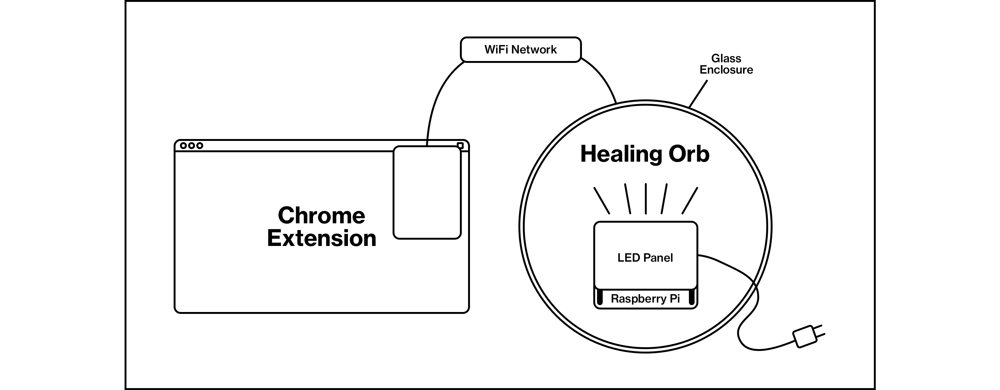

# Ambient Interface (Raspberry Pi)

Installs and runs a dockerized flask server on Raspberry Pi. This server exposes API that gives clients remote access to the Healing Orb's LED pannel via the local network.

To maintain a modular interface, the API endpoints provide no functionality beyond that of the SenseHat's. All data processing is done on the client-side.



## Installation

Connect the Raspberry Pi to your wifi through LAN or wifi, up to you.

### Docker (preferred)

Make sure you have docker installed.

```
$ docker pull moritzsalla/raspi-iot:latest
$ docker run --privileged --name mycontainer -p 443:443 -ti moritzsalla/raspi-iot:latest bash
$ python3 main.py
```

Based on Protik77's python3-based [dockerfile](https://hub.docker.com/r/protik77/python3-sensehat).

### Crude

**⚠️ I've been having major issues with the sense-hat package conflicting with other packages. Although its possible to find an approppreate Python version, its a buggy road and I strongly advise against it.**

Clone this repository:

```
$ git clone https://github.com/moritzsalla/REPO_NAME
$ cd REPO_NAME
```

Make sure you are running the correct python version.

Install requirements:

```
$ sudo apt-get update \
      && apt-get install --no-install-recommends --no-install-suggests -y \
      ca-certificates \
      curl \
      python3-numpy \
      python3-pil \
      python3-pip

$ curl -LO https://archive.raspberrypi.org/debian/pool/main/r/rtimulib/librtimulib-dev_7.2.1-3_armhf.deb \
      && curl -LO https://archive.raspberrypi.org/debian/pool/main/r/rtimulib/librtimulib-utils_7.2.1-3_armhf.deb \
      && curl -LO https://archive.raspberrypi.org/debian/pool/main/r/rtimulib/librtimulib7_7.2.1-3_armhf.deb \
      && curl -LO https://archive.raspberrypi.org/debian/pool/main/r/rtimulib/python3-rtimulib_7.2.1-3_armhf.deb \
      && curl -LO https://archive.raspberrypi.org/debian/pool/main/p/python-sense-hat/python3-sense-hat_2.2.0-1_armhf.deb
$ dpkg -i \
      librtimulib-dev_7.2.1-3_armhf.deb \
      librtimulib-utils_7.2.1-3_armhf.deb \
      librtimulib7_7.2.1-3_armhf.deb \
      python3-rtimulib_7.2.1-3_armhf.deb \
      python3-sense-hat_2.2.0-1_armhf.deb

# cleanup
$ sudo rm -f *.deb \
      && apt-get clean \
      && sudo rm -rf /var/lib/apt/lists/*

$ pip3 install sense-hat flask flask-cors
```

# Running the server

Figure out which hostname your Raspberry Pi has:

```
$ hostname -I
```

Navigate to this address. The installation has been successful if you see your Raspberry Pi flashing up.

```
http://{RASPI_IP}/test
```

Open this page from browser in your local network. The site will provide you an overview of the API.

```
http://{RASPI_IP}:8000/
```

# Folder structure

```
.
├── Dockerfile
├── README.md
├── app
│   ├── main.py
│   └── tests.py
└── hooks
    ├── post_checkout
    └── pre_build
```
