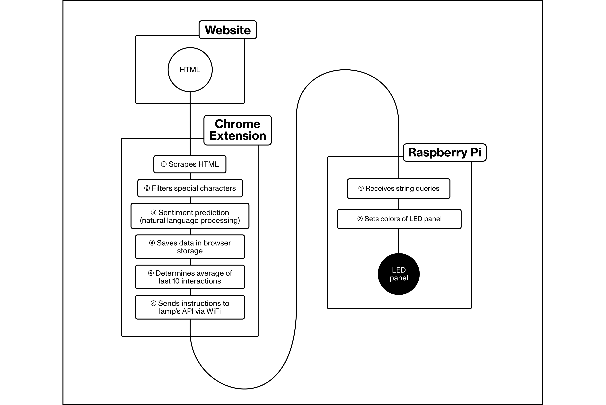

# Chrome Extension

A chrome extension that communicates with the Healing Orb's ambient interface. It is the head of the Healing Orb, as it performs the processing and animation. The extension's processing tasks include HTML scraping, string filtration, storage, mapping and easing. The extension also includes a popup which exposes readings and settings to the user.


## Data Flow



## Development

Run `yarn build` to bundle files into a chrome build  
Run `yarn clean` to format using prettify and remove cache + dist folders  
Run `yarn post-build` to compress the build into a zip

## Certificate Issues on Chrome

Chrome doesn't accept self-signed certificate issues. Read more [here](https://stackoverflow.com/a/58957322/10653440). To whitelist `https://192.168.0.24/`, type `thisisunsafe` when faced with the error screen.

### Folder Structure

```
.
├── background.js
├── content.ts
├── firebase-client.ts
├── images
│   ├── favicon.png
│   ├── favicon@2x.png
│   ├── favicon@3x.png
│   ├── favicon@4x.png
│   ├── store_icon.png
│   └── store_promo.jpg
├── manifest.json
└── popup
    ├── Popup.tsx
    ├── bootstrap.min.css
    ├── index.html
    └── index.tsx
```
