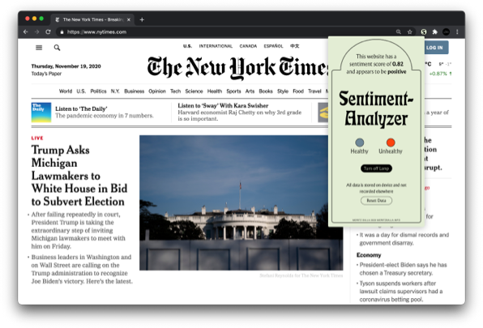

# Sentiment Chrome Extension



Crawls the page for paragraph tags and analyses them for sentiment. Once this is completed, a React modal displays the outcome. Ongoing project.

Run `yarn build` to bundle files into a chrome build  
Run `yarn clean` to format using prettify and remove cache + dist folders

The chrome store requires the `dist` folder to be packaged before upload.

# Certificate Issues on Chrome

Chrome doesn't accept self-signed certificate issues. Read more [here](https://stackoverflow.com/a/58957322/10653440). To whitelist `https://192.168.0.24/`, type `thisisunsafe` when faced with the error screen.

### Folder Structure

```
.
├── background.js
├── content.ts
├── firebase-client.ts
├── images
│   ├── favicon.png
│   ├── favicon@2x.png
│   ├── favicon@3x.png
│   ├── favicon@4x.png
│   ├── store_icon.png
│   └── store_promo.jpg
├── manifest.json
└── popup
    ├── Popup.tsx
    ├── bootstrap.min.css
    ├── index.html
    └── index.tsx
```
